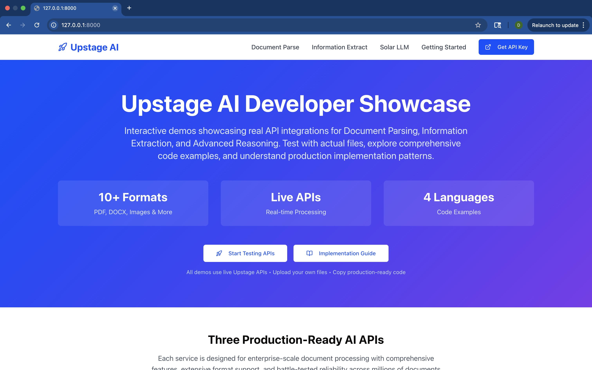
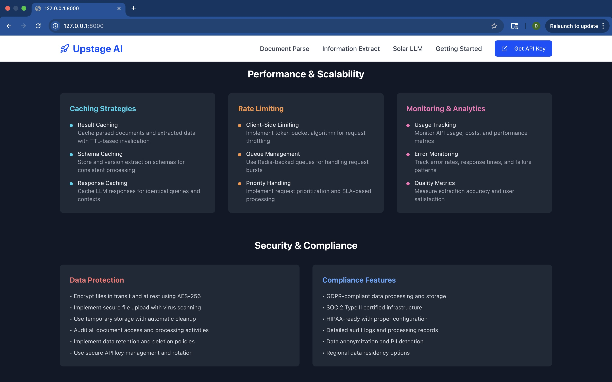

# 🚀 Upstage AI Demo Showcase

[](https://upstage-ai.onrender.com/)
[](https://github.com/DevangJagdale/Upstage-AI)
[]()

## !!! I am running my website on free services offered by render but when there’s no traffic server goes to sleep. However, each time I use it, service starts again, it can take up to a minute it to get back online. Please be patient !!!

> A comprehensive, beginner-friendly demonstration of Upstage AI's three core enterprise-grade capabilities. Built with clear explanations, interactive examples, and step-by-step guidance to help developers of all skill levels understand and implement powerful AI document processing solutions.

## 📋 Table of Contents

- [🎯 Project Overview](#-project-overview)
- [🛠️ Tech Stack](#️-tech-stack)
- [🌟 Why This Demo is Perfect for Beginners](#-why-this-demo-is-perfect-for-beginners)
- [✨ Interactive Demo Walkthrough](#-interactive-demo-walkthrough)
- [🖼️ Demo Screenshots & Explanations](#️-demo-screenshots--explanations)
- [🚀 Getting Started (Zero to Hero)](#-getting-started-zero-to-hero)
- [📚 Learning Resources & Tutorials](#-learning-resources--tutorials)
- [💡 Developer Experience Insights](#-developer-experience-insights)
- [🔮 Future Enhancements](#-future-enhancements)

## 🎯 Project Overview

This demo application is specifically designed to make Upstage AI's powerful capabilities accessible to developers at every skill level. Whether you're a complete beginner to AI or an experienced developer exploring document processing, this showcase provides clear, interactive examples that demonstrate real-world applications without overwhelming technical complexity.

## 🛠️ Tech Stack

### 🎨 **Frontend Architecture**

#### **Core Framework**
- **⚛️ React 18.3.1** - Modern React with hooks and concurrent features
- **📘 TypeScript 5.5.3** - Type-safe development with excellent IDE support
- **⚡ Vite 5.4.2** - Lightning-fast build tool and dev server
- **🎨 Tailwind CSS 3.4.1** - Utility-first CSS framework for rapid UI development

### 🔧 **Build & Development**

#### **CSS Processing**
- **🎨 PostCSS 8.4.35** - CSS transformation and optimization
- **🔄 Autoprefixer 10.4.18** - Automatic vendor prefix handling
- **📱 Responsive Utilities** - Mobile-first responsive design system


### 🌐 **Backend & API Integration**

#### **AI Services Integration**
- **🤖 Upstage Document Parse API** - Advanced OCR and document layout analysis
- **🔍 Upstage Information Extractor** - Schema-based structured data extraction
- **🧠 Upstage Solar LLM** - Conversational AI for document Q&A
- **🔐 Secure API Management** - Environment-based API key handling


### 🚀 **Deployment & Infrastructure**

#### **Hosting Platform**
- **🌐 Render.com** - Modern cloud platform with automatic deployments
- **🔄 CI/CD Pipeline** - Automatic builds from GitHub repository
- **📊 Performance Monitoring** - Built-in analytics and error tracking
- **🌍 Global CDN** - Fast content delivery worldwide

#### **Environment Management**
```bash
# Production Environment Variables
UPSTAGE_API_KEY=your_api_key_here
```


### 🔒 **Security & Best Practices**

#### **API Security**
- **🔐 Environment Variables** - Secure API key management
- **🛡️ CORS Configuration** - Proper cross-origin resource sharing
- **🔒 HTTPS Enforcement** - SSL/TLS encryption for all communications
- **⏱️ Rate Limiting** - Client-side request throttling


#### **Bundle Analysis**
```
Production Build Analysis
├── 📦 Main Bundle: ~150KB (gzipped)
├── 🎨 CSS Bundle: ~25KB (gzipped)
└── 🖼️ Assets: Optimized images and fonts
```

### 🧪 **Development Workflow**

#### **Local Development**
```bash
# Development server with hot reload
npm run dev          # Start development server
npm run build        # Production build
npm run preview      # Preview production build
npm run lint         # Code linting
npm run type-check   # TypeScript validation
```

#### **Code Organization**
```
client
  ├──src/
    ├── components/          # Reusable UI components
    │   ├── DocumentParser/  # Document parsing interface
    │   ├── InfoExtractor/   # Information extraction UI
    │   └── SolarChat/       # LLM chat interface

server/         
  └── server.ts      # server code for document parser  

```

### 🎯 **Why This Tech Stack?**

#### **🚀 Developer Experience**
- **Fast Development**: Vite's instant hot reload and TypeScript integration
- **Type Safety**: Catch errors at compile time, not runtime
- **Modern Tooling**: Latest React patterns and ES2020+ features
- **Easy Deployment**: Simple build process with optimized output

#### **🎨 User Experience**
- **Responsive Design**: Works perfectly on all devices
- **Fast Loading**: Optimized bundles and lazy loading
- **Accessible**: Built with accessibility as a first-class concern
- **Interactive**: Smooth animations and immediate feedback

#### **🔧 Maintainability**
- **Clean Architecture**: Separation of concerns with clear file organization
- **Type Safety**: TypeScript prevents runtime errors
- **Consistent Styling**: Tailwind CSS utility classes
- **Automated Quality**: ESLint and TypeScript compiler checks

#### **📈 Scalability**
- **Component-Based**: Reusable components for easy feature additions
- **API-First**: Clean separation between frontend and AI services
- **Performance**: Optimized for production with code splitting
- **Extensible**: Easy to add new AI capabilities or UI features


### 🎓 Educational Approach

- **Learn by Doing**: Interactive demos with immediate visual feedback
- **Progressive Complexity**: Start simple, then explore advanced features
- **Real Examples**: Use actual documents and see real results
- **Clear Explanations**: Every feature explained in plain English
- **No Prerequisites**: Works out of the box with minimal setup

## 🌟 Why This Demo is Perfect for Beginners

### 🎯 **Zero Learning Curve**
- **No AI Knowledge Required**: You don't need to understand machine learning or neural networks
- **Instant Results**: Upload a document and see AI magic happen in seconds
- **Visual Feedback**: Every action provides clear, immediate visual responses
- **Error-Friendly**: Helpful error messages guide you when something goes wrong

### 🔧 **Simple Setup Process**
```bash
# Just three commands to get started!
git clone https://github.com/DevangJagdale/Upstage-AI.git
cd Upstage-AI
npm install && npm run dev
```

### 📖 **Built-in Learning Materials**
- **Tooltips & Hints**: Hover over any feature for helpful explanations
- **Example Documents**: Pre-loaded samples to try immediately
- **Step-by-Step Guides**: Each demo includes a "How it Works" section
- **Common Use Cases**: Real-world scenarios you can relate to

### 🎮 **Interactive Learning Experience**
- **Try Before You Code**: Understand the capabilities before implementation
- **Experiment Safely**: Sandbox environment with no consequences
- **Compare Results**: See before/after examples side by side
- **Progressive Disclosure**: Advanced features revealed as you explore

## ✨ Interactive Demo Walkthrough

### 🚀 **Getting Started Journey**

#### **Step 1: Welcome & Overview (30 seconds)**
When you first visit the demo, you're greeted with:
- A friendly welcome message explaining what you'll learn
- Three clear cards showing each AI capability
- A "Try Demo Documents" button with pre-loaded examples
- No signup required - start exploring immediately!




#### **Step 2: Document Parse Demo (2-3 minutes)**
**What You'll Experience:**
1. **Upload Made Easy**: Drag & drop or click to upload any document
2. **Real-Time Processing**: Watch as the AI analyzes your document
3. **Visual Results**: See extracted text overlaid on the original document
4. **Interactive Exploration**: Click on different sections to see what was detected


**Beginner-Friendly Features:**
- **Sample Documents**: Try with provided examples (invoice, form, table)
- **Progress Indicators**: Clear loading states show what's happening
- **Error Handling**: Friendly messages if something goes wrong
- **Format Support**: Works with PDF, JPG, PNG - no conversion needed

**What You'll Learn:**
- How AI can read rotated or skewed documents
- Why this is better than traditional OCR
- Real business applications (processing invoices, forms, contracts)

#### **Step 3: Information Extraction Demo (3-4 minutes)**
**What You'll Experience:**
1. **Schema Builder**: Create extraction rules using a simple form interface
2. **Field Mapping**: Tell the AI what information you want to extract
3. **Smart Extraction**: Watch as structured data appears from unstructured documents
4. **Confidence Scores**: See how certain the AI is about each extraction


**Beginner-Friendly Features:**
- **Pre-built Templates**: Common schemas for invoices, resumes, contracts
- **Visual Field Mapping**: Click on document areas to define extraction zones
- **Validation Rules**: Set up data validation without coding
- **Export Options**: Download results as JSON, CSV, or Excel

**What You'll Learn:**
- How to turn messy documents into clean, structured data
- Why this eliminates manual data entry
- How to build custom extraction rules for your specific needs

#### **Step 4: Solar LLM Chat Demo (2-3 minutes)**
**What You'll Experience:**
1. **Document Upload**: Upload any document for AI analysis
2. **Natural Conversation**: Ask questions about the document in plain English
3. **Intelligent Responses**: Get accurate answers based on document content
4. **Context Awareness**: AI remembers previous questions in the conversation


**Beginner-Friendly Features:**
- **Suggested Questions**: Pre-written questions to get you started
- **Conversation History**: See all previous questions and answers
- **Document Highlighting**: AI shows which parts of the document it used
- **Multi-Language Support**: Ask questions in different languages

**What You'll Learn:**
- How AI can understand and reason about document content
- Applications for customer service and document analysis
- The difference between simple search and intelligent understanding

## 🖼️ Demo Screenshots & Explanations

### 📄 Document Parse Interface

**What Beginners See:**
- **Clean Upload Area**: Large, obvious drag-and-drop zone
- **Sample Documents**: One-click examples to try immediately
- **Processing Animation**: Visual feedback showing AI at work
- **Results Overlay**: Extracted text highlighted on original document

**Learning Outcomes:**
- Understand how AI handles complex document layouts
- See the difference between raw OCR and intelligent parsing
- Learn about confidence scores and accuracy metrics

### 🔍 Information Extractor Workflow

**What Beginners See:**
- **Schema Builder**: Visual form to define what data to extract
- **Field Preview**: Real-time preview of extraction results
- **Validation Indicators**: Green/red indicators showing data quality
- **Export Dashboard**: Simple buttons to download results

**Learning Outcomes:**
- Grasp the concept of structured vs. unstructured data
- Understand how to define extraction schemas
- Learn about data validation and quality control

### 🧠 Solar LLM Chat Interface

**What Beginners See:**
- **Chat Interface**: Familiar messaging layout like WhatsApp
- **Document Viewer**: Side-by-side document and chat
- **Suggested Prompts**: Example questions to get started
- **Source Citations**: AI shows where it found each answer

**Learning Outcomes:**
- Experience conversational AI in action
- Understand document-based question answering
- Learn about AI reasoning and context understanding


### 🎯 **Beginner-Friendly Code Examples**

#### **Simple Document Upload**
```typescript
// This is all the code needed to upload and parse a document!
const uploadDocument = async (file: File) => {
  const formData = new FormData();
  formData.append('document', file);
  
  const response = await fetch('/api/parse', {
    method: 'POST',
    body: formData
  });
  
  const result = await response.json();
  return result; // Parsed document data ready to use!
};
```

#### **Extract Information with Custom Schema**
```typescript
// Define what information you want to extract
const extractionSchema = {
  invoice_number: "string",
  total_amount: "number",
  due_date: "date",
  vendor_name: "string"
};

// Extract structured data from any invoice
const extractedData = await extractInformation(document, extractionSchema);
// Returns: { invoice_number: "INV-001", total_amount: 1250.00, ... }
```

#### **Chat with Your Documents**
```typescript
// Ask questions about any document in natural language
const askQuestion = async (question: string, document: File) => {
  const answer = await solarLLM.chat({
    message: question,
    document: document,
    context: previousConversation
  });
  
  return answer; // Intelligent response with source citations
};
```

### 🔧 **Development Environment Setup**

#### **Prerequisites (Don't Worry - We'll Guide You!)**
- **Node.js**: JavaScript runtime (we'll show you how to install)
- **Code Editor**: VS Code recommended (free and beginner-friendly)
- **Git**: Version control (optional but recommended)

#### **Step-by-Step Setup Guide**

1. **Install Node.js** (5 minutes)
   - Visit [nodejs.org](https://nodejs.org)
   - Download the LTS version (recommended for beginners)
   - Run the installer with default settings

2. **Get the Code** (2 minutes)
   ```bash
   # Option 1: Using Git (recommended)
   git clone https://github.com/DevangJagdale/Upstage-AI.git
   
   # Option 2: Download ZIP from GitHub
   # Click "Code" → "Download ZIP" on the GitHub page
   ```

3. **Install Dependencies** (3 minutes)
   ```bash
   cd Upstage-AI
   npm install  # This downloads all required packages
   ```

4. **Set Up Your API Key** (2 minutes)
   ```bash
   # Copy the example environment file
   cp .env.example .env
   
   # Edit .env file and add your Upstage API key
   # Get your free API key from: https://console.upstage.ai
   ```

5. **Start the Demo** (1 minute)
   ```bash
   npm run build
   npm run dev  # Starts the development server
   # Open http://localhost:8000 in your browser
   ```

## 🚀 Getting Started (Zero to Hero)

### 🎯 **For Complete Beginners**

#### **Never Used AI APIs Before?**
No problem! This demo is designed to be your first step into the world of AI development.

**What You'll Need:**
- ✅ A computer with internet access
- ✅ 15 minutes of free time
- ✅ Curiosity about AI and document processing
- ❌ No programming experience required to try the demo
- ❌ No AI knowledge needed

#### **Your Learning Path:**

**Phase 1: Explore (10 minutes)**
1. Visit the [live demo](https://upstage-ai.onrender.com/)
2. Try each of the three AI capabilities
3. Upload your own documents or use provided samples
4. Ask questions and see how the AI responds

**Phase 2: Understand (15 minutes)**
1. Read through the demo explanations
2. Try different types of documents
3. Experiment with various questions and extraction schemas
4. Notice how the AI handles different scenarios

**Phase 3: Implement (30 minutes)**
1. Set up the demo locally using our step-by-step guide
2. Look at the simple code examples
3. Try modifying small parts to see what happens
4. Use the provided documentation and comments

### 🎓 **Improvements better engage the dev community or improve docs**

## 📚 Learning Resources & Tutorials

### 🎥 **Video Walkthroughs**
- **Demo Overview** (5 min): Complete feature walkthrough
- **Setup Tutorial** (10 min): Step-by-step local installation
- **API Integration** (15 min): How to use Upstage APIs in your projects
- **Common Use Cases** (20 min): Real-world implementation examples

### 📖 **Written Guides**
- **Beginner's Guide to Document AI**: Understanding the basics
- **API Integration Patterns**: Best practices for production use
- **Error Handling Guide**: Dealing with common issues
- **Performance Optimization**: Making your AI apps fast and reliable

### 🛠️ **Interactive Tutorials**
- **Build Your First AI Feature**: 30-minute guided tutorial
- **Custom Schema Creation**: Learn to extract any data structure
- **Conversational AI Setup**: Create document-based chatbots
- **Production Deployment**: Take your demo to production

### 🤝 **Community Resources**
- **Discord Community**: Get help from other developers
- **GitHub Discussions**: Share ideas and ask questions
- **Stack Overflow**: Tagged questions and answers
- **Developer Blog**: Regular tutorials and use case studies

## 💡 Developer Experience Insights

### 🎯 **What Makes This Demo Special for Beginners**

#### **1. Progressive Disclosure**
- Start with simple concepts, gradually introduce complexity
- Each feature builds on the previous one
- Advanced options are hidden until you're ready
- Clear learning path from novice to expert

#### **2. Immediate Feedback**
- Every action provides instant visual response
- Error messages are helpful, not cryptic
- Success states are clearly communicated
- Progress indicators show what's happening

#### **3. Real-World Context**
- Examples use actual business documents
- Use cases are explained in business terms
- Benefits are quantified (time saved, accuracy improved)
- ROI is clear and measurable

#### **4. Safety and Experimentation**
- Sandbox environment with no consequences
- Sample data provided for safe testing
- Undo/reset options available everywhere
- No risk of breaking anything while learning

### 🚀 **Suggestions for Upstage Developer Engagement**

#### **Beginner-Focused Improvements**

1. **Interactive Onboarding**
   - Guided tour of each capability
   - Interactive tutorials within the console
   - Achievement system for completing tutorials
   - Beginner-friendly API explorer

2. **Learning Resources**
   - Video tutorials for each API
   - Step-by-step integration guides
   - Common use case templates
   - Troubleshooting cookbook

3. **Community Building**
   - Beginner-friendly Discord channels
   - Monthly "AI for Beginners" webinars
   - Mentorship program pairing beginners with experts
   - Showcase gallery of beginner projects

4. **Developer Tools**
   - Visual schema builder for information extraction
   - No-code integration options
   - Postman collections with examples
   - SDK with extensive documentation

#### **Advanced Developer Engagement**

1. **Technical Deep Dives**
   - Architecture decision records
   - Performance benchmarking tools
   - Advanced configuration options
   - Custom model fine-tuning guides

2. **Enterprise Features**
   - Batch processing examples
   - Webhook integration patterns
   - Rate limiting and scaling guides
   - Security best practices

3. **Innovation Programs**
   - Hackathon starter kits
   - Research collaboration opportunities
   - Beta feature early access
   - Developer advisory board

## 🔮 Future Enhancements

### 🎓 **Educational Features**
- [ ] **Interactive Code Playground**: Edit and run code directly in the browser
- [ ] **Tutorial Mode**: Step-by-step guided learning experience
- [ ] **Progress Tracking**: Save learning progress and achievements
- [ ] **Certification Program**: Upstage AI Developer certification

### 🛠️ **Developer Tools**
- [ ] **Visual API Builder**: Drag-and-drop API integration
- [ ] **Schema Designer**: Visual tool for creating extraction schemas
- [ ] **Testing Suite**: Automated testing tools for AI integrations
- [ ] **Performance Monitor**: Real-time API performance dashboard

### 🌐 **Platform Integrations**
- [ ] **No-Code Platforms**: Zapier, Microsoft Power Automate integrations
- [ ] **CMS Plugins**: WordPress, Drupal, and other CMS integrations
- [ ] **Cloud Storage**: Direct integration with Google Drive, Dropbox, OneDrive
- [ ] **Business Tools**: Slack bots, Microsoft Teams apps, Notion integrations

### 📱 **Mobile & Accessibility**
- [ ] **Mobile App**: Native iOS and Android demo apps
- [ ] **Voice Interface**: Voice commands for document processing
- [ ] **Accessibility Features**: Screen reader support, keyboard navigation
- [ ] **Offline Mode**: Basic functionality without internet connection

---

<div align="center">
  <p><strong>Built with ❤️ to make AI accessible to every developer</strong></p>
  <p><em>"The best way to learn AI is to start building with it"</em></p>

</div>
